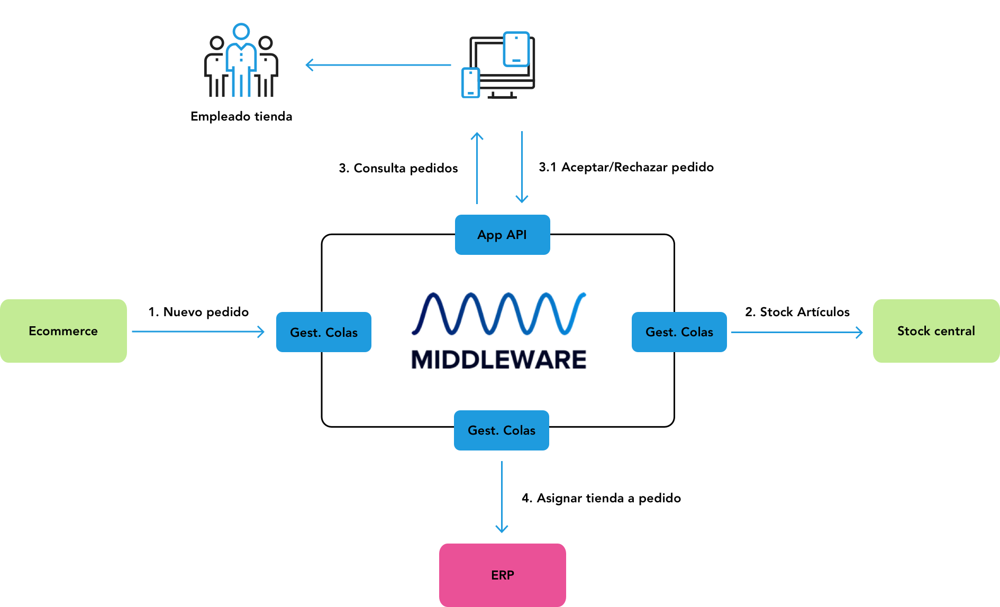

# Proposed solution for backend dev technical test
Hello, this is a practical development in JAVA based on Reactive Streams, Spring WebFlux, under the Spring Boot 2 environment, with mongodb and docker-compose. 
That allows to apply functional programming, without blockages in the request, totally asynchronous.

Applying the following functionalities in development:

- Project Reactor and Spring WebFlux-NoSQL with MongoDB
- API Rest reactive-Functional Endpoints (Router Functions)
- Eureka-Server
- docker-compose

## docker-compose dev configuration
First you must clone the entire project in your dev environment, already within the project there is a configured file: docker-compose.yml, it will allow 
you to start and lift the different containers associated with the project, such as:

- influxdb
- grafana
- k6
- mongodb

Within the same configuration file you will find other services that are disabled, associated with:

- eureka-server
- gataway-service
- person-service

The above services are enabled within the application in the different properties.

The first time Docker runs the command: `docker-compose up -d` using this configuration, it extracts the images configured in the services, then 
downloads and mounts them:

It is very important that the containers are active, the test will store data in mongodb, since the developer of the technical test knows very 
little about influxdb and how its integration with java would be; for this reason the application will save the data in an instance called: test, within the mongodb database manager.
